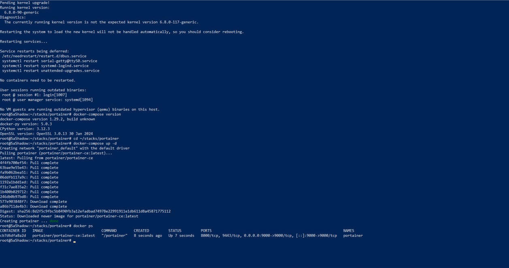
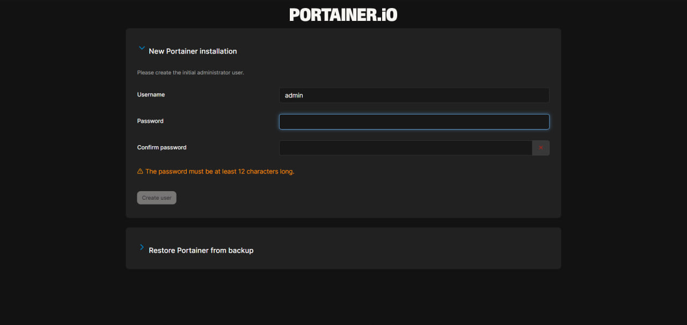
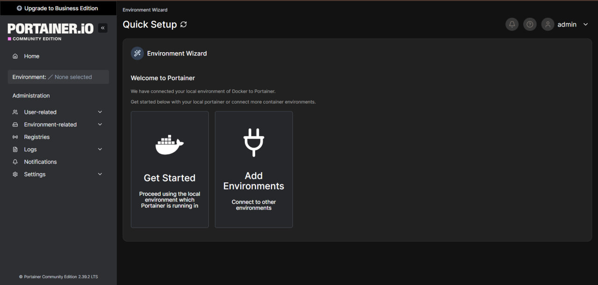
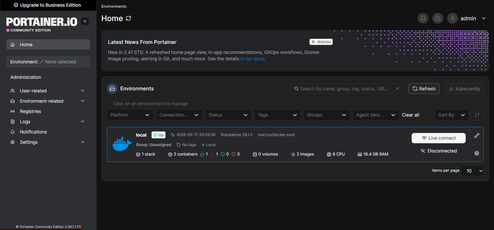

# Portainer Stack

Lightweight container management UI for Docker environments.

## Features

- Docker container management
- Web-based dashboard
- Stack deployment
- Volume and network management
- Easy monitoring

## Run

```bash
docker compose up -d
```

## Access

http://SERVER-IP:9000

## Notes

Portainer requires access to the Docker socket.
## Screenshots

### Terminal


### Login


### Dashboard


### Containers

